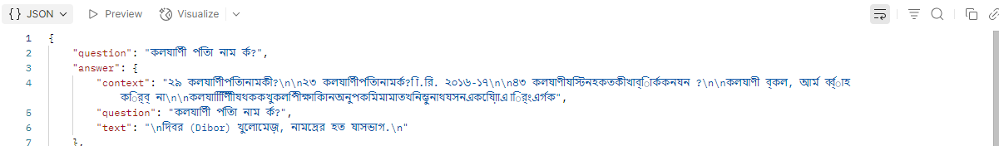


# Bangla-English RAG System with Qdrant and Sentence Transformers

## Overview

This project implements a Retrieval-Augmented Generation (RAG) system to answer queries in Bangla and English using a Bangla book PDF (`HSC26-Bangla1st-Paper.pdf`) as the knowledge base. It extracts paragraphs from the PDF, creates semantic embeddings with SentenceTransformers, stores them in the Qdrant vector database, and retrieves relevant chunks to generate answers with an LLM via LangChain.

---

## Setup Guide

1. Clone the repo:
   ```
   git clone https://github.com/TigerRakib/RAG_10MS.git
   cd RAG_10MS
   ```

2. Create a Python virtual environment (recommended):
   ```
   python -m venv venv
   venv\Scripts\activate      # Windows
   ```

3. Install dependencies:
   ```
   pip install -r requirements.txt
   ```

4. Install and run Qdrant:
   - Option 1: Run locally with Docker:
     ```
     docker run -p 6333:6333 qdrant/qdrant
     ```
   - Option 2: Install natively from https://qdrant.tech/documentation/quick_start/

5. (Optional) Setup Ollama or another LLM backend for LangChain:
   - Ollama: https://ollama.com/

6. Place the Bangla PDF (`HSC26-Bangla1st-Paper.pdf`) inside the `data/` folder.

7. Run main script to build index and query:
   ```
   python main.py
   ```
8. Run the FASTAPI Server (make sure your directory is at rag_system):
   ```
   python -m uvicorn main:app --reload

   ```
---

## Used Tools, Libraries & Packages

- **PyMuPDF (fitz):** Extract text blocks from PDF pages
- **SentenceTransformers:** To create semantic embeddings (model: `BAAI/bge-m3`)
- **Qdrant:** Vector database for storing and searching embeddings
- **LangChain:** For prompt templating and LLM chaining
- **Ollama:** LLM backend for answer generation. Models are (`mistral`, `phi` , `llama3`)
- **UUID:** For unique point IDs in Qdrant
- **FASTAPI:** For accessing end point API. 

---

## Sample Queries and Outputs

### Query 1 (Bangla):

Input:  
`অনুপমের ভাষায় সুপুরুষ কাকে বলা হয়েছে?`

Expected Output:  
`শুম্ভুনাথ`

Code Output:



---

### Query 2 (Bangla):

Input:  
`কাকে অনুপমের ভাগ্য দেবতা বলে উল্লেখ করা হয়েছে?`

Expected Output:  
`মামাকে`

---

### Query 3 (Bangla):

Input:  
`বিয়ের সময় কল্যাণীর প্রকৃত বয়স কত ছিল?`

Expected Output:  
`১৫ বছর`

---

## API Documentation

The system is wrapped with FastAPI to expose a `/ask/` endpoint:

- **Endpoint:** `/ask`  
- **Method:** POST  
- **Request JSON:**  
  ```json

  ```
  
- **Response JSON:**  
  ```json
  
  ```
  

## Questions & Answers

1. **What method or library did you use to extract the text, and why?**  
   We used PyMuPDF (`fitz`) to extract text blocks from the PDF. It provides access to layout information like block coordinates, allowing us to segment paragraphs more accurately. The main challenge was handling vertical spacing between lines to separate paragraphs properly, which we addressed by checking vertical distances (`para_threshold`).
   Challanges:
   1. Complex bangla pdf
   2. Pdf contains table, paragraph, bullet list.
   3. Complex grammer and morphology.
   4. Multiple Dialects and Scripts.

   I can extract the text more accurately using hybrid(text+picture) techniques.

2. **What chunking strategy did you choose?**  
   We chose paragraph-based chunking using vertical distance threshold and split paragraphs further if they exceed 1000 characters. This balances semantic coherence (keeping sentences/paragraphs intact) with manageable chunk size for embedding models, which improves retrieval quality.
   
   1. Smart chunking like(layout-aware chunking) can improve the result. 

3. **What embedding model did you use? Why?**  
   We used the `BAAI/bge-m3` SentenceTransformer, a Bangla-English bilingual model that creates dense vector representations capturing semantic meaning in both languages. It was chosen because it effectively handles bilingual text, improving cross-lingual retrieval.

4. **How do you compare the query with stored chunks?**  
   We embed the query with the same SentenceTransformer and use cosine similarity search in Qdrant to retrieve the top-k closest chunks. Cosine similarity is effective for semantic similarity in vector spaces, and Qdrant efficiently manages vector search with scalability.

5. **How do you ensure meaningful comparison?**  
   By using a bilingual embedding model and chunking text semantically, we align query and documents in the same semantic space. If the query is vague or lacks context, retrieval may return less relevant chunks. Adding query reformulation or prompt engineering for clarification can improve robustness.

6. **Do the results seem relevant? What might improve them?**  
   Results are generally relevant on tested queries. Improvements could include:  
   - Finer chunking (sentence-level with overlap)  
   - Larger or domain-adapted embedding models  
   - Better LLM prompts or fine-tuning for more accurate answer generation  
   - Expanding document corpus for richer knowledge

---
## Limitations

- **Bengali PDF Parsing:** Current parsing of Bengali PDFs is imperfect due to inconsistent fonts, encoding issues, and layout complexities. This affects the structure and quality of the extracted content used in the RAG pipeline.

- **Answer Quality:** The quality of generated answers depends heavily on:
  - The selected **Large Language Model (LLM)**
  - The **embedding model** used for vector search
  - The **preprocessed Bengali corpus** quality and chunking strategy

- **Lack of High-Quality Bengali Models:** There is a scarcity of powerful pre-trained LLMs and dense retrieval models specifically optimized for Bengali, which limits the overall performance.

- **Evaluation Challenges:** Evaluating generated answers for **groundedness** and **relevance** in Bengali remains difficult due to the lack of established multilingual QA metrics.

---

## Future Steps

- **Improved PDF Parsing:** Develop a more reliable and layout-aware Bengali PDF parsing pipeline to ensure clean and structured chunk extraction.

- **User Interface:** Create an interactive **chat-like frontend** to allow users to ask questions and receive contextual answers in real time.

- **Chat History:** Implement **chat memory and history tracking**, enabling personalized and context-aware conversations.

- **Evaluation Framework:** Design or adapt multilingual metrics to measure **faithfulness**, **fluency**, and **usefulness** of responses, particularly in Bengali.

- **Model Enhancements:** Explore fine-tuning existing multilingual or Bengali LLMs and embedding models (e.g., Bangla-BERT, IndicBERT, multilingual BGE variants) for improved performance in both retrieval and generation.
---
## Author

Nazrul Islam Rakib 
GitHub: https://github.com/TigerRakib

---

## License

MIT License

